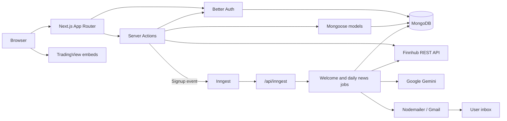
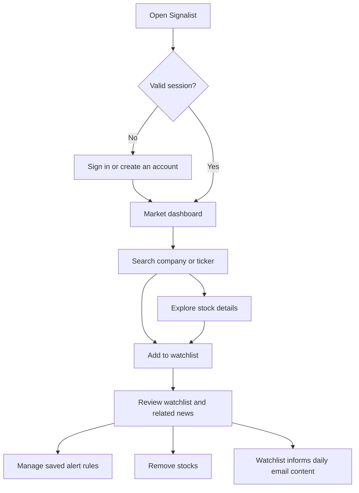
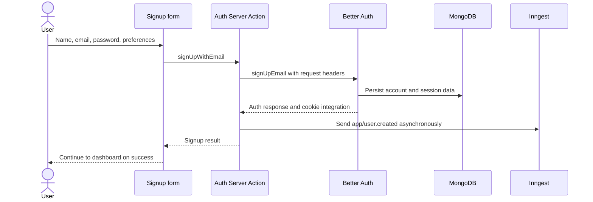
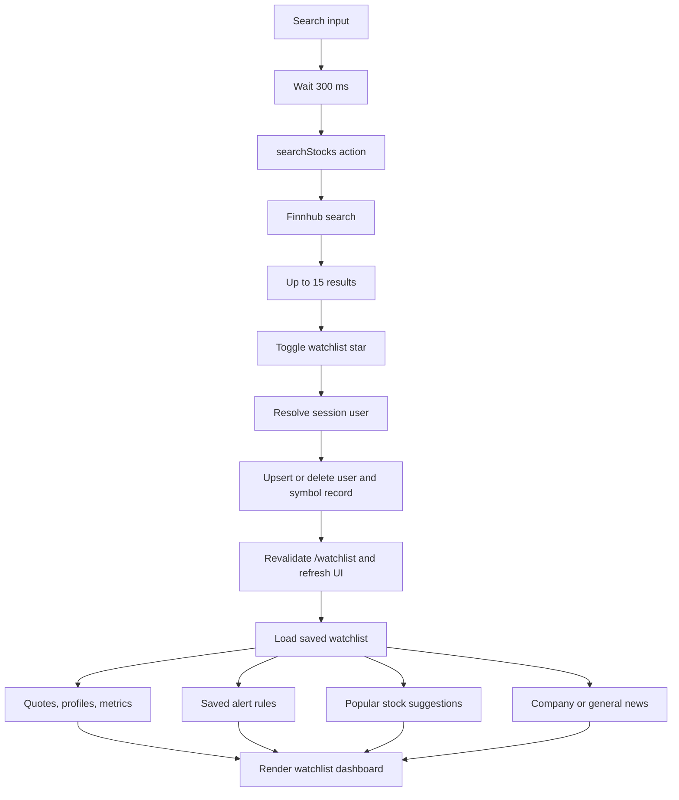
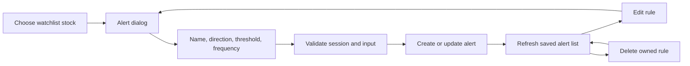
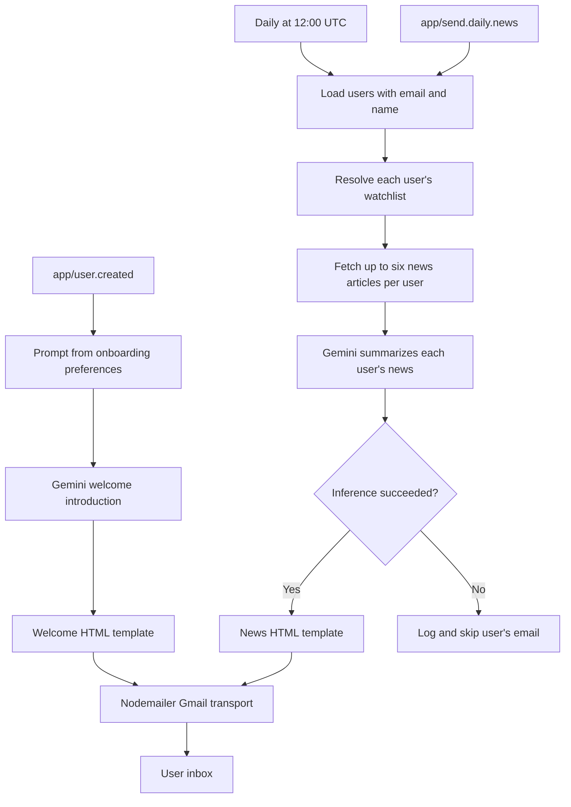
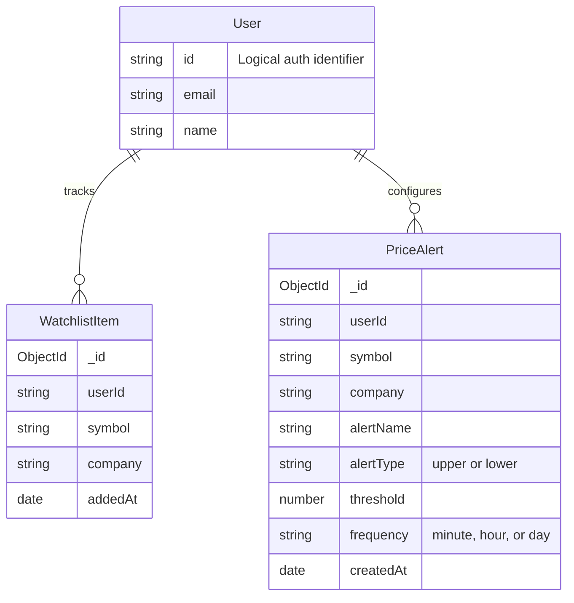

<div align="center">


# Your market. Your watchlist. Your daily briefing.

Stock research, personal watchlists, and AI-powered market emails in one dark, responsive workspace.


[Overview](#overview) · [Architecture](#architecture) · [Workflows](#workflows) · [Quick start](#quick-start) · [Configuration](#configuration) · [Development](#development)

</div>

---

## Overview

**Signalist** is a full-stack stock monitoring application built with the Next.js App Router. It combines TradingView visualizations, Finnhub stock data, MongoDB-backed watchlists, and background email workflows powered by Inngest and Google Gemini.

<p align="center">
  
  <br />
</p>

| Area | Implemented experience |
| :--- | :--- |
| Market dashboard | Market overview, stock heatmap, news timeline, and market quotes through TradingView widgets |
| Stock discovery | Ctrl/Cmd + K search, popular stocks, and company/ticker search with a 300 ms debounce |
| Company research | Symbol information, candlestick and baseline charts, technical analysis, profiles, and financials |
| Personal watchlist | Persistent stocks with quotes, percentage changes, market capitalization, P/E ratios, and news |
| Alert rules | Create, edit, and delete upper/lower thresholds with minute, hour, or day frequency settings |
| Authentication | Email/password signup, sign-in, sign-out, and cookie-backed sessions |
| Welcome emails | AI-personalized introductions based on onboarding preferences |
| Daily briefings | Scheduled, AI-generated summaries of watchlist-related news delivered through Gmail |

> **Implementation status:** Alert rules are saved and editable, but price evaluation and alert notification delivery are not implemented. Application quotes are fetched on server renders/refreshes; there is no application-owned streaming quote service or order execution.

## Technology stack

Versions reflect `package.json` declarations; `package-lock.json` records resolved dependencies.

| Layer | Technologies | Role |
| :--- | :--- | :--- |
| Application | Next.js **16.3.5**, React / React DOM **19.2.8** | App Router, server rendering, client interactions, Server Actions, route handlers |
| Language/runtime | TypeScript **5**, Node.js | Typed application code and server runtime |
| Styling | Tailwind CSS **4**, `@tailwindcss/postcss`, `tw-animate-css` | Styling, CSS processing, animations |
| Components | shadcn **4.x**, Base UI **1.x**, Radix Dialog / Popover | Reusable primitives; `base-vega` style and neutral theme configuration |
| UI utilities | Lucide React, `cmdk`, Sonner, `next-themes` | Icons, command search, notifications, theme integration in the toast wrapper |
| Class utilities | `class-variance-authority`, `clsx`, `tailwind-merge`, `cn` | Variants and conditional class composition |
| Forms | React Hook Form **7.x**, `react-select-country-list` | Authentication/onboarding forms and country options |
| Fonts | Inter, Geist, Geist Mono via `next/font/google` | Application typography |
| Authentication | Better Auth **1.7.x**, MongoDB adapter, `nextCookies` | Accounts, sessions, cookie integration |
| Persistence | MongoDB driver **7.x**, Mongoose **9.x** | Auth storage, schemas, indexes, cached connection |
| Market data | Finnhub REST API | Search, quotes, company profiles, financial metrics, news |
| Visualization | TradingView external widgets | Browser-loaded charts and financial information |
| Background jobs | Inngest **4.x**, Inngest CLI **1.x** | Events, schedules, resumable steps, retries |
| AI | Google Gemini through Inngest AI inference | Welcome copy and news summaries; default `gemini-2.5-flash-lite` |
| Email | Nodemailer **10.x**, Gmail transport | HTML email delivery |
| Tooling | npm, ESLint **9**, `eslint-config-next`, TypeScript type packages | Dependencies, linting, type checking |

`@vercel/speed-insights` is installed but is not mounted in the application. The root layout forces dark mode; there is no theme-switching UI.

## Architecture



Server pages assemble initial data; client components handle search, dialogs, watchlist controls, and toasts. Server Actions handle mutations. TradingView loads independently in the browser, while Finnhub supplies application stock data and news.

### Routes and access

| Route | Purpose | Access |
| :--- | :--- | :--- |
| `/sign-up` | Account creation and onboarding | Signed-out users |
| `/sign-in` | Email/password login | Signed-out users |
| `/` | Market dashboard | Signed-in users |
| `/stocks/[symbol]` | Company research | Signed-in users |
| `/watchlist` | Watchlist, saved alerts, news | Signed-in users |
| `/api/inngest` | GET, POST, PUT handlers for Inngest | Background job infrastructure |

The `(root)` layout checks sessions and redirects unauthenticated users to `/sign-in`. The `(auth)` layout redirects authenticated users to `/`. Auth uses Better Auth's server API through Server Actions; no `/api/auth/[...all]` route is included. `middleware/index.ts` exists but is not a root Next.js middleware/proxy entry point; layout checks provide the implemented page guards.

## Workflows

### 1. Complete user journey



### 2. Authentication and onboarding



Signup collects country, investment goals, risk tolerance, and preferred industry. Preferences are sent in the welcome event but are **not persisted as custom user fields** by the signup action. Event-send failures are logged without blocking account creation. Email verification is disabled; password length is configured to 8–128 characters.

Sign-in calls `signInEmail`, and sign-out calls `signOut`, using request headers and Better Auth's server API.

### 3. Search and watchlist data flow



Writes derive ownership from the session and normalize symbols to uppercase. A unique `(userId, symbol)` index prevents duplicate watchlist entries. Market data, alerts, suggestions, and news load concurrently on the watchlist page.

| Data | Current behavior |
| :--- | :--- |
| Search | 30-minute fetch cache; empty queries use a local list of 10 popular symbols |
| Quotes | Uncached Finnhub requests |
| Profiles and metrics | One-hour fetch cache |
| News | Uncached; last five days of company news, up to six symbols and six articles |
| News fallback | General news when no symbols exist or no valid company articles remain |
| Duplicate articles | Filtered by ID, URL, and normalized headline |
| Provider failures | Empty search results; placeholder market values; watchlist catches news errors and displays an empty list |

Company-news API failures propagate through `getNews` to its caller rather than automatically falling back to general news. Provider coverage and limits affect the data shown.

### 4. Saved alert lifecycle



The action requires a nonempty name and symbol and a finite positive threshold. Updates and deletes filter by session `userId`. Frequency values are stored configuration only: this workflow ends at persistence, without a price polling or notification worker.

### 5. AI email delivery



The daily function uses cron `0 12 * * *` (**12:00 UTC / 18:00 Asia/Dhaka**), concurrency **1**, a **one-run-per-five-minutes** throttle, and **3 retries**. Each user's AI summary has its own resumable inference step. News preparation errors become an empty article list; AI inference failures skip the affected user's email.

The daily delivery step sends multiple emails together. A partial send failure followed by a retry can resend already-delivered messages; throttling is not per-recipient deduplication. The welcome text fallback handles an empty AI response, not an inference failure.

## Data model



Relationships use logical string identifiers, not database-enforced foreign keys. Better Auth manages additional auth collections; only user fields relevant to application workflows are shown. Email-based lookups resolve `user.id` or fall back to the document `_id` string.

- **Watchlist:** indexed `userId`; unique compound index on `(userId, symbol)`.
- **Alerts:** indexed `userId`; nonunique compound index on `(userId, symbol, alertName)`.
- **Connection reuse:** a global cache stores the Mongoose connection and pending promise; a rejected promise is cleared for retry.
- **Deletion:** removing a watchlist item does not cascade-delete alert rules.

## Quick start

### Prerequisites

- Node.js **20.19+**, satisfying the installed MongoDB/Mongoose engine requirements, and npm.
- A reachable MongoDB database and Finnhub API key.
- For email jobs: Gemini credentials, a Gmail sender credential, and a running Inngest development server or configured cloud environment.

### 1. Install

From the repository root:

```bash
npm ci
```

### 2. Configure

Create `.env.local` in the project root and replace the placeholders below. Environment files are ignored by Git; no `.env.example` is currently committed.

```dotenv
# Database and authentication
MONGODB_URI=mongodb://127.0.0.1:27017/signalist
BETTER_AUTH_SECRET=replace-with-a-long-random-secret
BETTER_AUTH_URL=http://localhost:3000

# Market data
NEXT_PUBLIC_FINNHUB_API_KEY=your-finnhub-api-key

# AI generation
GEMINI_API_KEY=your-gemini-api-key
GEMINI_MODEL=gemini-2.5-flash-lite || your preferred model (ideally fast & lightweight)

# Gmail transport
NODEMAILER_EMAIL=your-sender@gmail.com
NODEMAILER_PASSWORD=your-gmail-app-password

# Local Inngest development only
INNGEST_DEV=1
```

Generate an auth secret locally:

```bash
node -e "console.log(require('node:crypto').randomBytes(32).toString('hex'))"
```

### 3. Run the application

```bash
npm run dev
```

Open [localhost:3000](http://localhost:3000). Signed-out users are redirected to login; create an account at `/sign-up`.

### 4. Run background jobs

In a second terminal:

```bash
npx inngest-cli dev -u http://localhost:3000/api/inngest
```

Open [localhost:8288](http://localhost:8288) and confirm `sign-up-email` and `daily-news-summary` are registered. Signup triggers the welcome job. To exercise the digest manually, send `app/send.daily.news` with an empty data object through the Inngest development dashboard.

The digest targets all eligible database users, so use a development database and test inboxes. Background emails require a running job runner and valid AI/email credentials.

## Configuration

| Variable | Purpose | Requirement |
| :--- | :--- | :--- |
| `MONGODB_URI` | Shared database connection | Core application |
| `BETTER_AUTH_SECRET` | Auth secret | Authentication |
| `BETTER_AUTH_URL` | Application origin | Match local/deployed origin |
| `NEXT_PUBLIC_FINNHUB_API_KEY` | Finnhub requests | Search, enrichment, news |
| `GEMINI_API_KEY` | Gemini inference | AI email jobs |
| `GEMINI_MODEL` | Model override | Optional; defaults to `gemini-2.5-flash-lite` |
| `NODEMAILER_EMAIL` | Gmail sender | Email delivery |
| `NODEMAILER_PASSWORD` | Gmail transport credential | Email delivery |
| `INNGEST_DEV` | SDK development mode | Local only; remove in production |
| `INNGEST_EVENT_KEY` | SDK event publishing credential | Inngest cloud configuration |
| `INNGEST_SIGNING_KEY` | SDK request verification credential | Inngest cloud configuration |

`INNGEST_*` values are SDK configuration rather than explicit application `process.env` reads. Finnhub currently uses a `NEXT_PUBLIC_` variable even though its reads are in server code; this prefix permits exposure if referenced by client code, so it is not a server-only naming convention.

## Project structure

```text
stocks_app/
├── app/
│   ├── (auth)/                 # Signup, sign-in, auth layout
│   ├── (root)/                 # Protected market dashboard
│   │   ├── stocks/[symbol]/    # Stock research
│   │   └── watchlist/          # Watchlist, alerts, news
│   ├── api/inngest/            # Job endpoint
│   ├── globals.css            # Theme and application styles
│   └── layout.tsx             # Fonts, metadata, toast provider
├── components/
│   ├── forms/                 # Reusable form fields
│   ├── ui/                    # Shared UI primitives
│   └── ...                    # Search, widgets, watchlist, alerts
├── database/
│   ├── models/                # Watchlist and alert schemas
│   └── mongoose.ts            # Cached connection
├── hooks/                     # Debounce and widget lifecycle
├── lib/
│   ├── actions/               # Auth, data, users, watchlist, alerts
│   ├── better-auth/           # Auth and cookie configuration
│   ├── inngest/               # Client, workflows, prompts
│   ├── nodemailer/            # Transport and HTML templates
│   ├── constants.ts           # Widget settings and suggestions
│   └── utils.ts               # Formatting and helpers
├── middleware/                # Helper; not a root entry point
├── public/assets/             # Logos, icons, preview images
├── types/global.d.ts          # Shared types
├── components.json            # shadcn configuration
├── next.config.ts             # Next.js configuration
└── package.json               # Dependencies and scripts
```

## Development

### Commands

| Command | Purpose | Notes |
| :--- | :--- | :--- |
| `npm run dev` | Development server | Default port 3000 |
| `npm run build` | Production build | Needs appropriate environment and service access |
| `npm start` | Production server | Run after building |
| `npm run lint` | ESLint | Repository flat configuration |
| `npx tsc --noEmit` | Explicit type check | Builds currently ignore type errors |
| `npm run test:db` | Declared database check | **Unavailable:** `scripts/test-db.mjs` is missing |

No automated unit or end-to-end test suite is included in the tracked project. `next.config.ts` enables `typescript.ignoreBuildErrors`, so a successful build does not establish type correctness.

### Manual verification

1. Sign up, sign out, and sign in with a test account; check protected-route redirects.
2. Search for a stock with Ctrl/Cmd + K and open its research page.
3. Add and remove watchlist stocks; refresh to verify persistence.
4. Check quote fields, company details, and news with valid Finnhub credentials.
5. Create, edit, and delete an alert rule; verify account separation with a second test user.
6. Inspect the welcome workflow and verify delivery to the test inbox.
7. Trigger the daily event against test users and inspect inference and delivery steps.

### Deployment

Use a Node.js-capable Next.js deployment environment. Authentication, database access, Server Actions, and Inngest handlers require a server runtime; a static export cannot support them.

1. Install dependencies and configure production database, auth, market data, AI, and email credentials.
2. Set `BETTER_AUTH_URL` to the deployed origin and remove local `INNGEST_DEV` configuration.
3. Run linting, explicit type checking, and the production build; investigate failures before release.
4. Deploy and configure Inngest cloud credentials and app synchronization against the deployed `/api/inngest` endpoint.
5. Verify both functions are registered, then check authentication and controlled email delivery.

Auth initialization opens the database when its module is imported, so build-time route processing may also need database access. `next/font/google` can require network access at build time. No deployment configuration or CI workflow is included in the tracked project.

## Troubleshooting

| Symptom | Check |
| :--- | :--- |
| `MONGODB_URI must be set` | Set the environment variable and restart the server. |
| Database connection fails | Database availability, credentials, DNS, network access, and IP access rules |
| Login does not persist | Auth secret, base URL, browser origin, cookies |
| Empty search or missing quote fields | Finnhub credentials, symbol support, rate limits; HTTP 429 triggers fallback behavior |
| Blank TradingView widgets | Embed script access, browser blockers, supported symbols |
| Missing welcome email | Event delivery, Inngest registration, Gemini inference, Gmail credentials |
| Repeated digest triggers are delayed | Five-minute throttle and concurrency limit |
| Saved alert never sends | Price evaluation and notifications are not implemented |
| `test:db` reports a missing module | Restore or implement its missing script |
| Build passes despite type errors | Run `npx tsc --noEmit`; builds currently ignore them |

## Current limitations and next steps

These are implementation gaps and potential improvements, not completed features:

- Implement price polling, threshold evaluation, and deduplicated alert delivery.
- Restore the database test script; add auth, ownership, watchlist, and job integration tests.
- Resolve type errors, remove `ignoreBuildErrors`, and add CI checks.
- Persist onboarding preferences if needed beyond the welcome email.
- Add per-recipient email idempotency and durable signup-event delivery; signup currently sends its event without awaiting it.
- Add email verification, account recovery, and digest subscription preferences; the application does not currently provide these flows.
- Harden email-based watchlist read helpers: unlike mutation actions, they accept an email argument without independently checking session ownership.
- Review AI-generated HTML handling; the current email pipeline inserts generated HTML into templates.
- Audit template links and unused scaffolding before release. A TradingView symbol-mapping prompt exists without an active mapping workflow.

## Contributing

Keep changes focused and describe behavior and verification. Run linting and explicit type checking, exercise affected workflows, and document new environment variables or jobs. Keep credentials out of commits.

For framework changes, read the installed Next.js documentation in `node_modules/next/dist/docs/`; this project uses version-specific APIs and conventions.

## License

No license file is currently included. `private: true` prevents accidental npm publication but does not grant a reuse license. Add an explicit license before distributing the project under open-source terms.

---

<p align="center"><sub><strong>Signalist</strong> · Research markets. Organize your watchlist. Stay informed.</sub></p>
